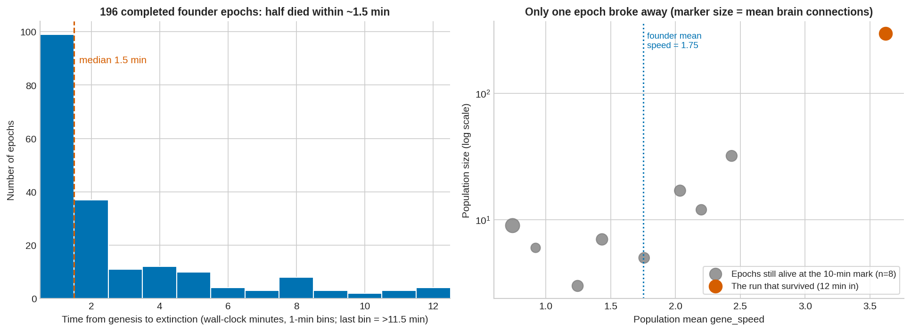
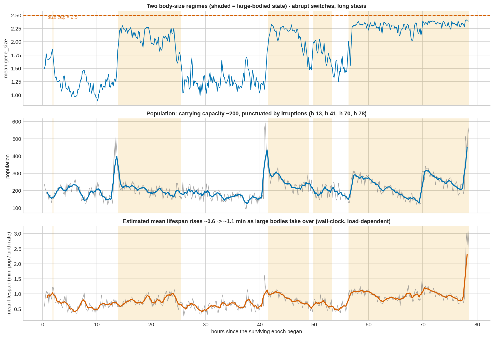
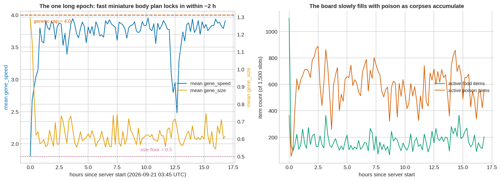
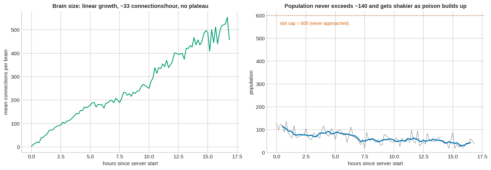
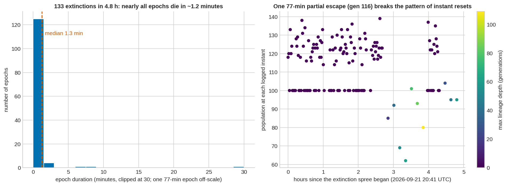
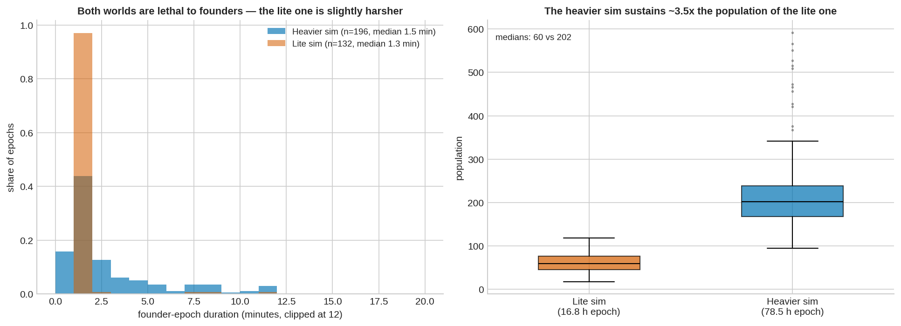

# Silicon Petri Dish (petriChip)

An autonomous, real-time evolutionary ecosystem and artificial life simulation framework. This project explores biologically-inspired mathematical ecosystems across different computational environments, ranging from edge microcontrollers to scalable Node.js servers. The simulation features emergent behaviors driven by neural networks, strict resource limitations, and physical interactions.

## Framework Architectures

The repository contains three distinct implementations of the simulation, each scaling in biological complexity and computational requirements.

### 1. BionotesESP32.ino: Native ESP32 Evolutionary Simulation

The foundational implementation runs entirely on an ESP32 microcontroller, hosting both a C++ physics engine and a mathematical neural-network ecosystem. 

*   **Fixed Topology Neural Networks:** Organisms possess 100-gene neural networks consisting of 8 sensory inputs, 8 hidden neurons, and 2 motor outputs.
*   **Edge Computing Dashboard:** The simulation broadcasts a high-performance 60 FPS dashboard to connected browsers via a local web server served directly from the ESP32 PROGMEM.
*   **Environmental Radiation via EMF:** The ESP32 asynchronously scans for nearby WiFi networks using `WiFi.RSSI()`. Strong local signals (such as a mobile hotspot) are interpreted as environmental radiation. This triggers physical displacement through electromagnetic drift and radically increases mutation rates, forcing saltation (extreme speciation events) if reproduction occurs during exposure.

### 2. server.js: Node.js NEAT Lite Architecture

A server-side implementation utilizing Node.js, designed for massive scale and topological evolution. 

*   **Expanded Ecosystem:** Supports a 3000x3000 dimensional arena capable of sustaining 600 simultaneous organisms and 1500 resource items.
*   **NeuroEvolution of Augmenting Topologies (NEAT):** Replaces the fixed neural topology with dynamic brains. Organisms start with rudimentary instinct wires and can randomly mutate to add nodes or connections, theoretically increasing cognitive capacity over evolutionary time.
*   **Memory States:** Organisms retain a cyclical memory vector, allowing historical context to influence immediate motor decisions.
*   **Automated Analytical Observer:** Integrates the Gemini API to periodically evaluate the CSV-logged population metrics, functioning as an artificial evolutionary biologist providing real-time hypotheses on the ecosystem's state.

### 3. server_v2.js: Advanced Biogeochemical and Trophic Ecosystem

The most sophisticated version, introducing strict conservation of mass, thermodynamic limits, and complex ecological niches.

*   **Strict Nutrient Cycling:** Mass is conserved perfectly. Burned metabolic energy, dead organism mass, and consumed resources return to a global geological nutrient pool (`globalFertilizer`), which mathematically dictates the replenishment rate of consumable items.
*   **Trophic Specialization:** Organisms evolve along a mutually exclusive trophic spectrum governed by genes for autotrophy (`gene_chloroplast`), detritivory (`gene_scavenger`), and predation (`gene_carnivore`). Detritivores extract energy from toxic corpses, while autotrophs draw trace energy directly from the environment.
*   **Milankovitch Cycles and Seasonality:** The environment undergoes cyclic climatic shifts. Short-term seasonal cycles (Spring, Summer, Autumn, Winter) alter food spawn rates and thermal penalties. Long-term epochs (Ice Age, Greenhouse Drought, Holocene) impose severe selective pressures on the population.
*   **Thermal Adaptation and Epidemiology:** Survival in climatic extremes requires the evolution of insulation (`gene_insulation`). Furthermore, winter seasons trigger viral outbreaks, necessitating the evolution of immunity (`gene_immunity`) to resist infection and metabolic drain.
*   **Intent and Kin Recognition:** Organisms use a dedicated neural output to signal aggressive or reproductive intent, introducing Hamilton's Rule (kin selection) into mating and combat decisions.

## Fundamental Biological Mechanics

Across all implementations, survival and replication are intrinsic metrics. There is no artificial fitness function.

*   **Sensory and Niche Selection:** Organisms perceive the distance, angle, and genetic similarity of the nearest living organism, as well as their own internal energy state. This allows for dynamic behavioral switching between foraging, evasion, and reproduction.
*   **Evolvable Morphology (r/K Selection):** Body plan genes (`gene_speed`, `gene_vision`, `gene_size`) dictate life-history strategies. High mass (K-selection) grants predation power and energy storage but incurs severe basal metabolic costs and high reproductive thresholds. Low mass (r-selection) enables rapid, cheap reproduction.
*   **Metabolic Constraints and Senescence:** Energy is depleted according to Kleiber's Law allometric scaling, kinetic drag, neural processing costs, and thermal penalties. Extrinsic stochastic mortality and age-related metabolic decay ensure continuous selective pressure.
*   **Reproductive Dynamics:** Sexual reproduction (crossover) requires mutual intent, threshold energy reserves, and morphological compatibility, enabling rapid discovery of beneficial traits. Asexual reproduction (mitosis) is biologically permitted but computationally penalized with exorbitant energy costs to enforce the advantage of mating.

## Empirical Observation Report: Advanced Biogeochemical Ecosystem (server_v2.js)

**Data:** `evolution_v2_log.csv` (680 rows, 2026-09-17 11:14 UTC → 2026-09-21 03:07 UTC) and `server_v2.js`
**All timestamps are UTC, as logged.** Hours ("h") are counted from the start of the surviving epoch (2026-09-17 20:37:24 UTC) unless stated.
**How to read this report:** each section separates *what the data show* from *how I read it*, and interpretations carry a confidence label. The log contains population means only (no distributions, no era, no event flags), so several readings are hypotheses, not proofs. §7 lists the limits.

---

## 1. Key findings

1. **The world is a near-lethal filter.** 197 extinction-and-restart events were logged. Of 196 completed founder epochs, the median lasted **1.5 min**, 51% were over in under 1.5 minutes, and only 8 (4%) reached the 10-minute log, all of them on the brink (3–32 individuals).
2. **One epoch escaped and has now run for 78.5 hours** (3 d 6.5 h): **1.36 million births ≈ 1.36 million deaths**, ancestry depth **10,516 generations**, still alive at the last row.
3. **Evolutionary rescue.** Within ~10 minutes of genesis the survivors had roughly doubled their speed (1.75 → 3.62), more than tripled their brain wiring (3 → 11 connections), and begun scavenging (0.004 → 0.11).
4. **Selection to a boundary.** Mean speed locked at **3.84 ± 0.04 against a hard cap of 4.0** and barely moved again (3.81 → 3.87 in ten-hour block means), so speed variation was effectively exhausted.
5. **Detritivory became the dominant feeding strategy.** The scavenger gene averages ~0.7, while autotrophy (chloroplast) and predation (carnivore) hover at ~4–5%.
6. **Directional thermal adaptation.** Insulation rose from 0.50 to ~0.85, as the code's cost structure predicts.
7. **Two alternative body-size states** (mean ≈ 1.3 vs ≈ 2.2) that switch abruptly and persist for hours. The large state has longer lives, lower birth rate and higher standing population: an r → K style shift.
8. **Punctuated dynamics.** Long stasis is broken by sudden population irruptions (peak **592 of a 600 cap** at 2026-09-19 13:37).
9. **Seasonal nutrient cycle.** The soil pool is ~5.9× larger in winter than spring, and population is ~21% lower in winter samples.
10. **Neutral evolution is visible.** Immunity random-walks across almost its whole range (0.06–0.97) because no epidemic ever took hold (never more than one infected creature).
11. **Brain "complexity" grows linearly (~10 connections/hour) with no plateau, but this is probably mostly inert wiring**: in the current code, hidden nodes never pass a signal on (§5.10, §7).

---

## 2. Data and method

### 2.1 What the columns mean

| Column | Meaning (from the code) |
|---|---|
| `gen` | **Number of extinctions since the server process started**, not generations. |
| `max_lineage` | Deepest ancestry depth among creatures alive at that moment (this *is* generations). |
| `avg_*` | Population means of the trait genes (`size`, `speed`, `immunity`, `insulation`, `chloroplast`, `scavenger`, `carnivore`) and of brain connection count. |
| `max_age`, `max_energy` | Maximum over living creatures (ticks, energy units). |
| `births`, `deaths` | Cumulative since process start. |
| `food`, `poison` | Active plant items / active "poison" items (which are also corpses). |
| `fertilizer` | Size of the soil nutrient pool (`globalFertilizer`). |
| `season` | 0 spring, 1 summer, 2 autumn, 3 winter, at the moment of the snapshot. |

A row is written every **10 minutes**, plus an immediate **forced row on every extinction** (which captures the fresh genesis population).

### 2.2 Server sessions (inferred from cumulative counters resetting to 200)

| Session | Start | Last row | Duration | Extinctions | Note |
|---|---|---|---|---|---|
| 0 | 09-17 11:14 | 09-17 11:25 | 0.18 h | 3 | Genesis has ~1,000 food items, 24k fertilizer, unlike later sessions, so the code changed before session 1 |
| 1 | 09-17 11:25 | 09-17 13:34 | 2.15 h | 47 | |
| 2 | 09-17 13:36 | 09-17 20:34 | 6.97 h | 146 | |
| 3 | 09-17 20:34 | 09-21 03:07 | 78.54 h | 1 | First extinction 2.4 min in; the next epoch **survived** |

Sessions 1–3 have statistically identical genesis states, so I treat them as one system. I assume the uploaded `server_v2.js` produced session 3.

### 2.3 Definitions used

- **Epoch duration** = time between successive genesis rows (sessions 0–2 only; 196 completed epochs).
- **Mean lifespan** = population ÷ birth rate (Little's law), in **wall-clock** minutes. It is load-dependent (§7).
- **Body-size state** = "large" when mean size passes 1.8, "small" again when it drops below 1.5 (hysteresis, so noise doesn't flip it).
- Statistics "after h 1" or "after h 10" skip the initial transient.

---

## 3. World mechanics that shape the biology

| Mechanism in the code | Selective consequence |
|---|---|
| 400 founders, random 1–5-wire brains, 1,000 energy each, 25% of initial items toxic | Harsh founder filter; strong early selection for foraging and against poison |
| Metabolism = `0.05·size^0.75` (Kleiber) + `0.01·size·v²` + vision + age + `0.0001 × connections` | Larger bodies cheaper per unit mass; speed and brain size carry real costs |
| Plant item = `60·(1 − carnivore)`; poison/carrion item = `−80 + 140·scavenger` | Scavenger gene is toxic-to-profitable switch at ~0.57; costs nothing on plants |
| `chloroplast + scavenger + carnivore ≤ 1`; photosynthesis only in spring/summer; chloroplast makes movers sessile | Trophic trade-off; autotrophy is weak (`0.1·gene` energy per tick) |
| Winter cost `(1 − insulation)·0.10`, summer cost `insulation·0.05`; Ice/Greenhouse eras rescale both | Normal-era optimum is insulation → 1; Greenhouse era favours lower |
| Mitosis at energy > `300·size` (child costs `200·size`); mating needs mutual intent and > `150·size` | Body size sets reproductive threshold, so it couples to life history |
| All burned energy and dead mass return to `globalFertilizer`; food spawns in proportion to it | Closed nutrient cycle with seasonal spawn rate (spring 0.40, winter 0.05) |
| Winter viral seeding (50%), contact transmission, immunity reduces infection | Potential for host–pathogen selection (not realised, §5.9) |
| Hard clamps: speed 0.5–4, size 0.5–2.5, vision 20–200 | Directional selection can hit a wall |

---

## 4. Chronology of the surviving run

Means over the ±30-minute window around each mark (first row is a single sample, 10 min after genesis).

| Time | Pop | Size | Speed | Connections | Scavenger | Chloroplast | Carnivore | Insulation | Immunity | Max lineage |
|---|---|---|---|---|---|---|---|---|---|---|
| Founders | 600 | 1.50 | 1.75 | 3.0 | 0.004 | 0.004 | 0.004 | 0.50 | 0.50 | 1 |
| 10 min | 296 | 1.22 | 3.62 | 11.0 | 0.11 | 0.080 | 0.057 | 0.35 | 0.54 | 76 |
| h 1 | 181 | 1.67 | 3.85 | 18.8 | 0.43 | 0.058 | 0.051 | 0.63 | 0.36 | 222 |
| h 2 | 162 | 1.64 | 3.79 | 29.7 | 0.76 | 0.064 | 0.050 | 0.76 | 0.21 | 335 |
| h 10 | 210 | 0.97 | 3.82 | 123.5 | 0.71 | 0.073 | 0.056 | 0.87 | 0.35 | 1,727 |
| h 20 | 189 | 2.08 | 3.81 | 233.3 | 0.63 | 0.062 | 0.048 | 0.90 | 0.87 | 3,135 |
| h 30 | 190 | 1.22 | 3.86 | 331.9 | 0.62 | 0.045 | 0.039 | 0.91 | 0.43 | 4,595 |
| h 40 | 153 | 1.18 | 3.89 | 435.8 | 0.79 | 0.048 | 0.054 | 0.84 | 0.32 | 5,989 |
| h 50 | 197 | 1.87 | 3.85 | 497.6 | 0.57 | 0.053 | 0.038 | 0.87 | 0.69 | 7,215 |
| h 60 | 275 | 2.30 | 3.87 | 604.1 | 0.78 | 0.050 | 0.035 | 0.85 | 0.38 | 8,555 |
| h 70 | 241 | 2.28 | 3.85 | 665.2 | 0.79 | 0.056 | 0.036 | 0.80 | 0.62 | 9,719 |
| h 77 | 207 | 2.33 | 3.87 | 716.6 | 0.69 | 0.044 | 0.035 | 0.79 | 0.84 | 10,438 |

Final row (2026-09-21 03:07): pop 527, 1,360,349 births, 1,360,622 deaths, max lineage 10,516, 730 connections.

---

## 5. Biological phenomena observed

### 5.1 Founder bottleneck and repeated mass extinction

**Observed.**
- 196 completed epochs (sessions 0–2): median **1.5 min**, mean 2.8 min, interquartile range 1.1–3.5 min, longest 17.3 min. 99 epochs (51%) lasted under 1.5 minutes; only 8 (4%) lasted ≥10 minutes.
- Every genesis snapshot matches the random priors (mean size 1.502, speed 1.750, immunity 0.499, insulation 0.499, 3.02 connections), a good sanity check that the log reflects the code.
- The 8 epochs that reached a timed log were all near-extinct (pop 3–32, median 8) and all still in season 2. Each was followed by another extinction.
- Compared with founders, those 8 survivor populations already had **larger brains (mean 7.5 vs 3.0 connections)**.

**Reading.**
- A classic **boom-and-bust founder crash**: founders start with 1,000 energy and random brains, expand to the slot cap (400 → 600), and then most lineages starve before selection can act. Most epochs end in **complete extinction through a severe bottleneck**.
- The larger brains in the near-extinct survivors are best read as **survivorship bias**: only creatures with working sensor-to-motor wiring endured. Confidence: high for the pattern, moderate for the mechanism.
- All 8 timed logs land in season 2 because genesis always resets to spring and 10 min is ten seasons, which implies ~55–60 s per season (§7).

*Fig. 1: Left: 196 founder epochs, heavily skewed toward immediate collapse. Right: at the 10-minute mark, the eight near-extinct epochs versus the run that survived.*

### 5.2 Evolutionary rescue in the one surviving epoch

**Observed.** At the first timed log (10 min after genesis) the population was 296 (from 600) and already far from the founder state: speed **3.62 (×2.1)**, connections **11 (×3.6)**, scavenger **0.11 (×28)**, chloroplast 0.08, carnivore 0.057, deepest lineage **76 generations**. The standing crop of poison items fell from **76 to 1**. The failed epochs at the same age had speed 0.74–2.43 and populations of 3–32.

**Reading.** This looks like **evolutionary rescue**: a population that would otherwise have gone extinct adapts fast enough (dozens of generations in minutes) to avoid it. The removal of the poison stock is consistent with the scavenger gene evolving in response to it. Chance still plays a role: founder wiring is random, and one success in 197 tries cannot separate a reproducible route from a lucky start. Confidence: high that rapid directional selection occurred, low on why this epoch and not others.

### 5.3 Directional selection to a genetic boundary (speed)

**Observed.** Mean speed was **3.84 ± 0.04** (SD across 471 windows after the first), against a clamp of 4.0. It exceeded 3.7 in 98.7% of windows and crept up only slightly over 78 hours (3.81 → 3.87 in ten-hour block means).

**Reading.** Directional selection drove the trait into the hard clamp, after which **variance is exhausted** (fixation at or near the ceiling). This is a good demonstration of a **constraint on adaptation** set by the model rather than by biology: the quadratic movement cost (`0.01·size·v²`) was clearly outweighed by foraging gains, so the optimum lies beyond the allowed range. Raising the cap would test that. Confidence: high.

*Fig. 2: Speed (top left), brain connections (top right), trophic genes (bottom left), insulation and immunity (bottom right) for the surviving run.*

### 5.4 Trophic evolution: scavenging dominates

**Observed.**
- The scavenger gene rose from 0.004 to ~0.43 by h 1 and ~0.76 by h 2, then stayed around **0.68 on average (range 0.28–0.87)**.
- Chloroplast averages ~0.05 and carnivore ~0.04, both drifting down slowly. The three means sum to ~0.77 (range 0.25–0.95), close to the ≤ 1 trade-off ceiling.
- After h 2 the poison/corpse count is tiny (mean 1.8, median 1, max 8), while plant items average ~67–76 in every season.

**Reading.**
- **Detritivory (scavenging) became the dominant niche.** The likely reason is that the gene turns a −80 toxin into up to +60 energy and costs nothing on ordinary plant items, so it is close to a free advantage. Corpses are eaten almost as fast as they appear, a tight **necromass recycling loop**.
- **No established autotroph or predator guild is visible.** Because only means are logged, a specialist subpopulation below roughly 4–5% cannot be excluded.
- The scavenger mean dips repeatedly (to 0.28–0.5) and recovers. Its correlation with poison count is ~0, so I read the dips as relaxed selection and drift when corpses are scarce, not as frequency-dependent cycling. Confidence: moderate for the mechanism, high for the pattern.

### 5.5 Thermal adaptation: insulation

**Observed.** Insulation went from 0.50 to a mean of **0.845 (SD 0.075)** after h 1, above 0.8 in 81% of windows after h 5. There are **clusters of low values** (< 0.72): h 11.5–14.2 (10 windows), h 54.7–57 (5), and shorter dips near h 66, 70 and 76.

**Reading.**
- Under the code's costs the normal-era optimum is insulation = 1 (winter penalty double the summer one), so this is **directional selection for cold tolerance**, held slightly below the cap by mutation.
- Eras are **not logged**. The low-insulation clusters are consistent with Greenhouse eras (which double summer overheating and halve winter cost), but this is a hypothesis. Confidence: high for the overall trend, low for the era attribution.

### 5.6 Alternative stable states: body size and life history

**Observed.** Mean size is **bimodal** (modes ≈ 1.3 and ≈ 2.2) and switches abruptly:

| State | Starts (UTC) | Approx. length |
|---|---|---|
| Small | from genesis (brief blip near h 2) | ≈13.7 h |
| **Large** | 09-18 10:27 (h 13.8) | 11.6 h |
| Small | 09-18 22:17 (h 25.7) | 15.7 h |
| **Large** | 09-19 14:07 (h 41.5) | 7.5 h |
| Large (after brief dip) | 09-19 22:27 (h 49.8) | 3.5 h |
| Small | 09-20 02:07 (h 53.5) | 2.7 h |
| **Large** | 09-20 04:57 (h 56.3) | 22 h and continuing |

Comparison after h 10:

| | Small state | Large state |
|---|---|---|
| Mean size | 1.29 | 2.16 |
| Population | 191 | 228 |
| Births per minute | 323 | 262 |
| Mean lifespan (min) | 0.62 | 0.90 |
| Oldest individual (ticks) | 11,100 | 16,500 |
| Mean immunity | 0.32 | 0.55 |
| Soil nutrient pool | 7.6k | 12.8k |

**Reading.**
- This is a **fast/slow (r vs K) life-history axis**: small bodies reproduce quickly and die young, large bodies breed slowly and live longer. The deepest-lineage advance also slows (~170/h in h 1–10, ~125–135/h mid-run, ~105/h at the end, though the last figure also reflects the late slowdown), consistent with longer generation times.
- Size in the large state sits within ~5–12% of the 2.5 cap, so a **Cope's-rule-like drift toward large size** is being limited by the clamp.
- Large bodies also have the larger population, the opposite of Damuth's law, possibly because the large state coincides with a richer nutrient pool.
- The small state reaches a mean of **0.88** (h 10.2), 41% below the founder mean, a resource-limited miniaturisation that echoes insular dwarfism only loosely (the code has no island effect).
- The switches are abrupt with long stasis between them: **punctuated equilibrium**. Because only means are logged, I can't tell a whole-population shift from a change in the mix of two clades. A **clade replacement/selective sweep** is the simplest reading. Confidence: high for the two states, moderate for the mechanism.

*Fig. 3: Body-size state (shaded = large), population, and estimated lifespan. The lifespan spike in the last 40 minutes is a slowdown artefact (§7).*

### 5.7 Irruptions and sudden population upshifts

| When (UTC) | Change | Notes |
|---|---|---|
| 09-18 09:47 (h 13.2) | pop 168 → **473**, peak 509 | Births ≈ 2× the surrounding baseline for ~1 h; large-body state takes over 40 min later |
| 09-19 13:27 (h 40.8) | pop 153 → **551**, peak **592** (2026-09-19 13:37) | 98.7% of the 600 slot cap; back to ~275 in 1 h; large-body state takes over 40 min later |
| 09-20 18:27 (h 69.8) | pop 125 → **310**, held at 210–340 for ~5.5 h, then eased to ~170–250 | No size change (already large) |
| 09-21 02:27 (h 77.7) | pop 211 → **516**, `max_age` 17,170 → 7,229, fertilizer 26k → 63k | Only window in the run where the oldest age fell by more than 45% |

**Reading.**
- The first two are classic **irruption then overshoot and decay**. In both, the large-bodied state took over about 40 minutes later (n = 2, so treat as an observation, not a rule).
- The last window is what a **mass mortality of old individuals followed by a recruitment pulse** would look like: the oldest survivor's age collapses while the soil pool jumps. It could be a severe winter/Ice-Age era, a manual meteor, or something else; the log can't say.
- The four upshifts show that **carrying capacity is not fixed**: it stepped from ~200 to ~300 for hours. Confidence: high that the shifts happened, low on causes.

### 5.8 Seasonal ecology and nutrient cycling

Statistics for windows after h 1:

| Season | Mean pop | Mean soil pool | Mean plant items |
|---|---|---|---|
| Spring | 234 | 3.4k | 73 |
| Summer | 222 | 8.7k | 76 |
| Autumn | 218 | 7.5k | 67 |
| **Winter** | **184** | **20.0k** | 73 |

The population differs by season (Kruskal–Wallis p ≈ 3×10⁻¹⁴).

**Reading.**
- A clean **seasonal sawtooth**: winter famine (spawn rate 0.05) lets the pool build up as deaths return energy to the soil, and the spring bloom (0.40) draws it back down (~5.9× swing).
- Population falls ~21% in winter samples.
- Plant items stay flat across seasons (67–76). The nominal spawn rate varies 8× (spring 0.40, winter 0.05), but spawns scale with *pool × rate* and the pool moves the opposite way, so effective spawning varies only ~1.7× (≈0.8–1.4 spawns/tick using mean pools, ignoring eras). That is a built-in **nutrient buffer**, together with consumer-set demand; the means can't separate the two. Confidence: high for the sawtooth, moderate for the buffering reading.

*Fig. 4: Population and soil nutrient pool by season at the moment of sampling.*

### 5.9 Neutral evolution and the absence of epidemics (immunity)

**Observed.**
- Mean immunity wanders across **0.064–0.961** (mean 0.44, SD 0.25). Its 10-minute autocorrelation is 0.94, falling to 0.73 at 1 h and ~0.08 at 6 h. It correlates with body size (r = 0.35).
- `infected_pop` was non-zero in only **14 of 473 windows**, always exactly **1** creature, always in **winter**.

**Reading.**
- The gene carries **no cost when uninfected** and infections never spread (effective R < 1), so there is **no pathogen-driven selection**. What we see is **genetic drift in a small population** (~200), plus **hitchhiking**: immunity shifts alongside the body-size sweeps in §5.6.
- The single infected creature matches the code's winter seeding (50% chance at each winter's start).
- **The Red Queen hypothesis is not supported here.** Confidence: high for drift and no epidemics, moderate for the hitchhiking link.

### 5.10 Neural complexity growth (probably mostly neutral bloat)

**Observed.** Connections rose from 3 → 11 (10 min) → 124 (h 10) → 233 (h 20) → 436 (h 40) → 604 (h 60) → **730** (end), a near-linear ~10 connections/hour (5.8–12.1/h across 5–10-hour windows) with **no plateau**. That is ≈ 0.07 connections per generation (730 ÷ 10,516) against an expected **+0.10 per birth** from the mutation operator alone (delete −0.2, add-node +0.15, add-connection +0.15). At 730 connections the brain tax (0.073/tick) is **~76% of a size-2.4 body's basal cost** (0.096/tick).

**Reading.**
- Growth at ~70% (or more, since the deepest line overstates mean depth) of what mutation alone would produce says **selection is barely resisting**, consistent with **near-neutral accumulation under a weak drift barrier** (genome/complexity "bloat").
- Code check: in `processBrain`, connections read `nodes[c.in]` from the pre-propagation array, so any connection starting at a **hidden** (≥ 28) or **output** (16–27) node always contributes 0. I confirmed with a test: a direct sensor→motor wire gives 0.76, the same wire split through a hidden node gives 0. Only 16 inputs × 12 outputs = **192 possible functional slots** exist; **add-node mutations functionally delete a live wire while adding a connection**.
- So `avg_connects` overstates real neural elaboration, and this "phenomenon" is better labelled **accumulation of mostly inert structure** than cognitive evolution. Confidence: high for the growth, moderate-to-high for the inert-wiring reading (code-based; I can't see the functional fraction in the log).

### 5.11 Demographic steady state and longevity

**Observed.** Births and deaths agree to 0.02% over 1.36 M events. After h 1 the population averages **213 (SD 67, CV 0.32, range 95–592)**, with ~17,300 births per hour (~290/min). Estimated mean lifespan is **0.6–0.7 min** in small-body periods and **0.8–1.0 min** in large-body periods. The record `max_age` is **26,858 ticks** (2026-09-19 15:37, large state).

**Reading.**
- The population sits at a **resource-limited carrying capacity**, not the slot cap (600), which was approached only once.
- The deepest line advances ~100–170 generations per hour (roughly one generation per 20–35 s of wall-clock for the fastest lineage), which fits inside a mean lifespan of 0.6–1 min because reproduction happens mid-life.
- The oldest individuals live several times the mean lifespan, a heavy longevity tail (tick-rate conversions are uncertain, §7). Confidence: high.

### 5.12 Expected phenomena that were **not** observed

- **Host–pathogen cycles (Red Queen):** no (§5.9).
- **Photosynthetic or predatory guilds:** not evident from means (§5.4).
- **Predator–prey oscillations:** no signal; the log has no per-guild counts.
- **Speciation:** not measurable (no hue, diversity or clade data).
- **Long-run extinction:** none in 78 h, unlike the first 196 epochs.

---

## 6. Summary table

| Phenomenon | Evidence in the log | Confidence |
|---|---|---|
| Founder bottleneck / mass extinction | 196 epochs, median 1.5 min | High |
| Survivorship bias in near-extinct snapshots | 8 epochs, brains 7.5 vs 3.0 | High |
| Evolutionary rescue | Speed ×2.1, connections ×3.6 in 10 min | High (pattern) / Low (why) |
| Directional selection to a ceiling | Speed 3.84 ± 0.04 vs cap 4.0 | High |
| Trophic specialisation (detritivory) | Scavenger ~0.7; poison ≈ 1 | Moderate |
| Thermal adaptation | Insulation 0.50 → 0.85 | High |
| r → K life-history states | Size, lifespan, birth rate contrast | Moderate–High |
| Punctuated equilibrium / clade replacement | Abrupt size switches | Moderate |
| Population irruption and overshoot | Peaks of 509 and 592 | High (pattern) / Low (cause) |
| Carrying capacity | Pop ≈ 200, births ≈ deaths | High |
| Seasonal cycle + nutrient cycling | Winter pool ×5.9, pop −21% | High |
| Genetic drift / hitchhiking | Immunity 0.06–0.97, no epidemics | High / Moderate |
| Neutral complexity accumulation | ~10 connections/h, inert hidden nodes | Moderate–High |
| Red Queen | Not supported | n/a |
| Insular dwarfism | Loose analogy only | Low |

---

## 7. Caveats and code-level notes

1. **Averages only.** A shifted mean can be a whole-population change or a change in the mix of two groups. Fixation, bimodality and guild sizes can only be bounded, not measured.
2. **Sampling vs seasons.** Ten-minute samples alias with the season cycle (~1 min per season early on) and the era cycle (36,000 ticks). Season is a snapshot label; the era is not logged.
3. **Wall-clock vs ticks.** Tick cost grows roughly linearly with the number of living creatures (each scans all 1,500 item slots and 600 creature slots several times per tick), so the sim slows as it fills. Per-minute rates and the lifespan estimate are load-dependent. In the **last ~40 minutes** births per 10 min fell to 1.5–2.1k while population doubled, inflating the lifespan estimate. Three consecutive winter windows with near-identical fertilizer (62.4–63.3k) are most likely **phase-locking of the 10-minute sampling to the seasonal cycle**, not a plateau (hypothesis).
4. **Season length.** All 8 timed logs in sessions 1–2 show season 2. That implies roughly 55–60 s per season (~50 ticks/s) early on, the closest fit to the code's intent, rather than the ~2 minutes in its comment (other solutions exist).
5. **Unlogged interventions.** Radiation bursts (55% saltation per birth for 10 s), meteors (90% kill) and food drops can't be told apart from natural variation. Single-window connection-count dips of 20–28 (e.g. h 61.0, 69.9, 71.2, 75.2) are candidates for radiation bursts, or just noise.
6. **Code version.** Session 0 differs from later sessions, so the code changed between them; subtler edits between sessions 2 and 3 can't be excluded.
7. **Inert hidden nodes** (§5.10): fixing evaluation order (topological order or multiple passes) would make the connection count meaningful.
8. **Infection seeding:** the seeding code picks two independent random creatures, one to infect and one to receive `viralLoad = 1`, so patient zero starts at zero viral load. Minor, but it slightly lowers epidemic potential.
9. **Small samples:** the 8 near-extinct snapshots are tiny (pop 3–32) and only usable as a survivorship signature.

---

## 8. Suggested logging for the next run

- **Per-gene SD or histograms** to see fixation and bimodality directly.
- **Counts per trophic class** (chloroplast/scavenger/carnivore above 0.5), not only means.
- **Era, tick counter and ticks/second**, so rates can be normalised to ticks.
- **Event flags** (meteor, radiation, food drops) and infection counts.
- **Hidden-node count and functional-connection count** per brain.
- **Sampling period not commensurate with the season** (or per-season min/max/mean) to avoid aliasing.

---

## Appendix: figures

| File | Content |
|---|---|
| `docs/images/fig1_founder_filter.png` | Founder epoch duration histogram; survivors at 10 min |
| `docs/images/fig2_trait_trajectories.png` | Speed, connections, trophic genes, insulation/immunity |
| `docs/images/fig3_size_regimes_life_history.png` | Size states, population, estimated lifespan |
| `docs/images/fig4_seasonality.png` | Population and soil pool by season |

Keep the PNGs in the same folder as this `.md` so the image links resolve.

---

## Empirical Observation Report: NEAT Lite Architecture (server.js)

# Observation Report: Artificial-Life Sandbox, Lite Version (`server.js`)

**Data:** `evolution_log.csv` (245 rows, 2026-09-21 03:45:35 UTC → 2026-09-22 01:29:34 UTC, one continuous 21.7-hour server run) and `server.js`
**All timestamps are UTC.** Hours ("h") are counted from whichever epoch start is stated in each section.
**How to read this report:** each section separates *what the data show* from *how I read it*, with a confidence label. The log has population means only (no per-individual data, no seasons or eras here at all), so several readings are hypotheses, not proofs. §6 lists the limits.

This is a smaller, simpler cousin of the `server_v2.js` sandbox: no seasons, no immunity/insulation genes, no trophic (chloroplast/scavenger/carnivore) genes, and — importantly — **no nutrient-mass conservation**. Mating here is governed by colour similarity (`hue`) rather than a neural "consent" signal, and predation only requires a size and energy edge. Where a mechanic differs from the v2 sandbox, it's called out, since it changes the biology.

---

## 1. Key findings

1. **One lucky epoch ran for 16.8 hours**, then the world entered a **133-extinction, 4.8-hour mass-extinction spree** where almost every fresh population died in about a minute.
2. **The long epoch swept to its speed cap and its size floor within ~2 hours**, then held there (mean speed 3.6–3.9 against a hard cap of 4.0; mean size fell to 0.5–0.7 against a floor of 0.5) — a fast, miniature body plan.
3. **The long epoch self-poisoned to death.** With no way to recycle corpses, "poison" items (which include dead bodies) accumulated over the epoch — up to 888 of 1,500 slots — while food, competing for the same slots, was squeezed down; population drifted from ~90 to ~45 as this happened, and the epoch finally went extinct.
4. **Brain wiring grew roughly linearly** for the whole 16.8 hours (~33 connections/hour, 3 → 458, no plateau) — and, as with the heavier sandbox, the code makes most of that wiring functionally inert (§5.4).
5. **The subsequent 133 epochs were almost all instant failures**: median lifetime **1.3 minutes**, only 3 lasted beyond 2 minutes, and one reached **77 minutes** with visible adaptation (speed 2.3 → 3.2, lineage depth 53 → 109) before it too collapsed.
6. **The very last epoch in the log (gen 133) is still running** as the data ends, and — after surviving past the 1–2-minute danger zone — shows the same early signature as the original long epoch: lineage climbing (0 → 59 in 30 min) and speed rising (1.7 → 2.1 → 2.0 → 1.9).
7. **Population never approached the 600-slot capacity** in this run; it topped out at 139 and mostly ran below 100.

---

## 2. Data, code, and method

### 2.1 Columns

Same core columns as the heavier sandbox, minus season/immunity/insulation/trophic/fertilizer fields: `gen` = cumulative extinctions since server start (not generations); `max_lineage` = deepest ancestry depth among creatures currently alive; `avg_*` = population means; `max_age`/`max_energy` = maxima; `births`/`deaths` = cumulative since server start; `food`/`poison` = active item counts.

A row is written every **10 minutes**, plus a **forced row on every extinction**.

### 2.2 What's different from the mechanics of the heavier version

| Mechanic | Lite version (`server.js`) | Heavier version (for contrast) |
|---|---|---|
| Founders | 100 of 600 slots, energy 200 each, brains 1–5 wires | 400 of 600 slots, energy 1000 each |
| Metabolism | `0.015·size` baseline + `0.005·size·(|motorL|+|motorR|)` movement — no allometric (Kleiber) scaling | `0.05·size^0.75` + `0.01·size·v²` — cheaper per unit mass for large bodies |
| Poison | Fixed `−80` energy, no trait mitigates it; dead bodies also become permanent poison items | Toxicity offset by a `scavenger` gene; dead mass eventually decays back to a shared nutrient pool |
| Food/poison economy | **No mass conservation** — food spawns at a flat 20% chance/tick if a slot is free; poison items only clear by being eaten | Closed nutrient cycle (`globalFertilizer`) with seasonal spawn rates |
| Mating trigger | Requires **hue (colour) similarity** (`hueDiff < 20`) plus energy and size thresholds — a phenotype-matching rule, not a neural signal | Requires a mutual neural "intent" output plus energy/size thresholds |
| Predation trigger | Attacker just needs `size > 1.5×` defender **and** more energy; no trophic gene needed | Requires a `carnivore` gene, a neural "aggression" output, and `size > 1.2×` |
| Random death | Flat `0.00001`/tick chance | Age- and size-scaled senescence curve |
| Seasons / eras / radiation cycle | None logged; only a manual radiation-burst trigger exists | Full season and era (Ice Age/Greenhouse) cycle |

These differences matter: with no nutrient recycling and no toxin-resistance gene, this world has **fewer escape routes** from a resource crisis than the heavier one, which shows up directly in the data below.

### 2.3 The shape of the run

`gen` (cumulative extinctions) stayed at **0 for the first 101 rows (16.8 hours)** — the population never fully died out — then jumped from 0 to 133 across the remaining 143 rows (4.8 hours), one extinction almost every row. So this 21.7-hour log really contains **134 epochs**: one long one, then a burst of 133 short ones.

---

## 3. The long first epoch (h 0–16.8, 2026-09-21 03:45 → 20:35 UTC)

### 3.1 Rapid convergence to a fast, small body plan

| Time | Pop | Mean size | Mean speed | Connections | Max lineage |
|---|---|---|---|---|---|
| Founders (t=0) | 128 | 1.29 | 1.81 | 3.0 | 1 |
| h 1 | 87 | 0.58 | 3.59 | 40.7 | 186 |
| h 4 | 117 | 0.55 | 3.71 | 141.1 | 875 |
| h 8 | 62 | 0.64 | 3.84 | 231.5 | 1,924 |
| h 12 | 95 | 0.66 | 3.77 | 366.5 | 3,455 |
| h 16.8 (last) | 38 | 0.62 | 3.91 | 457.5 | 5,272 |

Mean speed exceeded 3.7 in 73% of the epoch's windows; mean size bottomed at **0.542**, barely above the 0.5 floor. Across the whole epoch, size and speed are strongly anti-correlated (r ≈ −0.66).

**Reading.** This is **directional selection to both boundaries at once**. Because movement cost here scales with motor output × size (not size × speed², as in the heavier sandbox) and baseline cost scales linearly with size (not size^0.75), there's no real energetic penalty for being small *and* fast — being tiny is close to strictly cheaper, and moving fast still finds food efficiently. So the model's own cost structure predicts exactly this fast-miniature outcome. Confidence: high.

### 3.2 A world that poisons itself

Food and (separately) poison item counts over the epoch:

| Time | Food | Poison |
|---|---|---|
| t=0 | 1,102 | 366 |
| h 4 | 189 | 669 |
| h 8 | 105 | 545 |
| h 12 | 88 | 435 |
| h 16 | 217 | 480 |
| last 20 rows, mean | 194 | 588 |

Poison peaked at **888** active items (of 1,500 slots) partway through the epoch. Poison and mean size are negatively correlated (r ≈ −0.44); poison and mean energy are also negatively correlated (r ≈ −0.52).

**Reading.** In this version, **every death drops a permanent poison item**, and nothing converts it back into food (no decay, no fertilizer, no scavenger gene). Food spawns at a flat 20% chance per tick *only into an empty slot* — so as poison fills the 1,500-slot arena, there are fewer empty slots for new food to appear in. The result is a **slow self-poisoning of the environment**: more deaths → more poison → fewer empty slots → less food → more deaths. Population fell from a mean of ~87 in the first 4 hours to ~46 in the last 4, correlating with hours elapsed at r ≈ −0.66. This mechanism — not predation, disease, or a season — is the most likely proximate driver of the eventual extinction at h 16.8. Confidence: moderate-high (the item-count trend is directly observed; the causal chain follows from the code, but isn't separately instrumented).

### 3.3 Brain growth, again mostly inert

Connections rose from 3 to 458 across the epoch, close to linear (~33/h on average, ranging 14–41/h across 4-hour windows) with **no plateau**, correlating with elapsed time at r ≈ 0.99.

**Reading.** As in the heavier sandbox, I checked `processBrain`: it evaluates connections in a single pass over a pre-update node array, so **a connection sourced from a hidden node (id ≥ 26) or another output always reads 0** — confirmed with a direct test (a sensor→motor wire produces a real signal; the same wire split through a hidden node produces none). With only 16 inputs × 12 outputs (192 possible direct slots), most of this near-perfectly-linear "brain growth" is very likely **inert wiring accumulating under weak or no selection**, not increasing cognitive capacity. Confidence: high for the growth pattern, moderate-high for the inert-wiring reading (code-based, not directly measurable from the log).

*Fig. 1: Left — mean speed rushes to its cap and mean size collapses toward its floor within about 2 hours, both essentially fixed for the next 15. Right — active poison items climb and stay well above food for the rest of the epoch.*

*Fig. 2: Left — connections per brain grow almost linearly for the full 16.8 hours. Right — population trends down as the environment fills with poison; the 600-slot cap (dotted) is never approached.*

---

## 4. The extinction spree (h 0–4.8 from 2026-09-21 20:41 UTC)

### 4.1 A near-universal 1–2 minute filter

133 extinctions occurred in 4.8 hours. Epoch durations:

| Statistic | Value |
|---|---|
| Median | 1.3 min |
| 25th / 75th percentile | 1.20 / 1.32 min |
| Epochs under 2 min | 128 of 132 (97%) |
| Longest | 77.4 min (one epoch) |
| Second-longest | 8.9 min |

**Reading.** This is the same **founder-bottleneck filter** documented in the heavier sandbox's sessions 0–2, but noticeably harsher here: essentially every fresh 100-founder population dies almost immediately, with no toxin-resistance gene and no nutrient buffer to fall back on. Since each new epoch gets a *fresh* item pool (25% poison, matching genesis ratios exactly — confirmed in the data), the self-poisoning problem from §3.2 resets each time; what kills these populations so fast instead is most likely simply that very few of the random 1–5-wire founder brains can find food and avoid poison before starving, and there's no time within a minute or two for mutation to fix that by chance. Confidence: high for the pattern, moderate for the exact mechanism (not separately instrumented).

### 4.2 The one epoch that (partly) broke through — and the one still running

**Gen 116 (an ordinary founder round) unexpectedly lasted 77 minutes**, and showed real evolution in that time:

| | Start | End (77 min later) |
|---|---|---|
| Population | 69 | 80 |
| Mean size | 1.50 | 0.84 |
| Mean speed | 2.34 | 3.16 |
| Max lineage | 53 | 109 |
| Connections | 19.4 | 16.1 |

It then went extinct like the rest.

**The final epoch in the log (gen 133) is still alive** when the data ends, and by the last row (30 minutes in) had reached population 95, lineage depth 59, mean speed rising toward 2.0, and 19 connections per brain — the same early trajectory the original successful epoch showed in its first hour. Whether it goes on to survive as long, or joins the 133 that didn't, isn't knowable from this log.

**Reading.** Read together with the original 16.8-hour epoch (which also started from ordinary founders and also happened to survive), this looks like **evolutionary rescue is a rare, stochastic event** in this world rather than something that gets easier with practice: of 134 fresh starts in this log, exactly one clearly succeeded, one partially and briefly succeeded, and one is a live unresolved case at the point the data cuts off. Confidence: high that the pattern holds in this log; the underlying success rate could differ over a longer run.

*Fig. 3: Left — epoch durations during the 4.8-hour spree, overwhelmingly under 2 minutes. Right — population trajectory through the spree; almost every epoch (dark purple) resets within a minute or two, except gen 116's 77-minute run (colour = lineage depth) which climbs before it, too, collapses.*

---

## 5. Phenomena not observed (and why, given this version's mechanics)

- **Trophic diversification, thermal adaptation, immune drift, seasonal cycling:** the code has no chloroplast/scavenger/carnivore, insulation, immunity, or season/era system in this version, so none of these can appear here — a direct consequence of it being the "lite" build, not a finding about the population.
- **Sustained large-bodied states:** unlike the heavier sandbox's alternating small/large regimes, this population converged on one small-fast strategy and stayed there for the whole surviving epoch; the metabolic cost structure here doesn't reward size the way Kleiber scaling does in the other version.
- **Colour-based speciation:** the mating rule requires similar hue, which could in principle drive assortative mating and colour clustering, but hue isn't logged, so this can't be checked from the CSV. Flagged as worth logging.
- **Predation pressure:** predation only needs a 1.5× size and energy edge here (no dedicated carnivore gene), but with the population converging on a narrow, small size range, opportunities for one individual to be 1.5× larger than another may have become rare — again unconfirmed, since kills aren't logged separately from other deaths.

---

## 6. Caveats

1. **Averages only** — as with the heavier sandbox, a population-mean shift can't distinguish a uniform trait shift from a change in group composition.
2. **No mass/energy accounting fields** (no fertilizer-equivalent column here) — the self-poisoning story in §3.2 is inferred from food/poison counts, not measured directly as an energy balance.
3. **Tick rate vs wall clock** — as before, simulation speed likely depends on population and item load, so wall-clock rates (e.g., "connections per hour") are approximate, not a fixed tick-based rate.
4. **Single long-run sample size** — the "one success in many founder rounds" pattern is based on one dataset; it shows that outcome varies enormously, not the long-run success probability.
5. **hue/diet/kill data absent** — several plausible dynamics (assortative mating, predation frequency) can't be checked with the columns logged here.
6. **The final epoch (gen 133) is unresolved** — its trajectory is suggestive but the log ends before its fate is known.

---

## 7. Suggested logging for next run

- **Item-slot occupancy breakdown** (empty vs food vs poison) directly, to confirm the food-starvation mechanism in §3.2 quantitatively.
- **Mean hue and hue variance**, to test for colour-based assortative mating/speciation.
- **A predation-event counter**, separate from other death causes.
- **Functional vs. total connection count** in the brain (as suggested for the heavier sandbox), since most of the logged brain growth here is likely inert.
- **A shorter, fixed-tick sampling interval early in each epoch** (the first minute is where most epochs live or die, and 10-minute logging mostly misses it — the forced extinction-row log is currently the only fine-grained signal available).

---

## Appendix: figures

| File | Content |
|---|---|
| `docs/images/fig1_first_epoch_sweep.png` | Speed/size convergence and the food-vs-poison squeeze in the 16.8-hour epoch |
| `docs/images/fig2_first_epoch_brain_pop.png` | Brain growth and population decline in the 16.8-hour epoch |
| `docs/images/fig3_extinction_spree.png` | Epoch-duration histogram and population trace through the 133-extinction spree |

Keep the PNGs in the same folder as this `.md` so the image links resolve.

---

## Comparative Ecological Analysis (server_v2.js vs server.js)

# Comparison: Heavier vs. Lite Artificial-Life Sandboxes

Comparing `server_v2.js` / `evolution_v2_log.csv` (the "heavier" sim — seasons, eras, immunity/insulation, trophic genes, closed nutrient cycle) against `server.js` / `evolution_log.csv` (the "lite" sim — none of that, plus a different metabolism and mating rule). Full detail on each is in `evolution_v2_observation_report.md` and `evolution_lite_observation_report.md`; this note focuses on where they agree, where they diverge, and why the code differences plausibly explain it.

## At a glance

| | Heavier sim | Lite sim |
|---|---|---|
| Log span | 87.9 h (4 server sessions) | 21.7 h (1 continuous session) |
| Total extinctions logged | 346 (199 in early sessions + a further 146 within the "surviving" session before it, too, kept going) | 133 |
| Longest single epoch | **78.5 h**, still alive at the last row | **16.8 h**, ended in extinction |
| Founder-epoch median lifetime | 1.5 min (n=196) | 1.3 min (n=132) |
| Founder-epoch longest outlier | 17.3 min | 77.4 min |
| Population in the long epoch | median 202 (range 95–592), cap 600 never approached until h 78 | median 60 (range 18–139), cap 600 never approached |
| Final lineage depth reached | 10,516 generations (still climbing) | 5,272 generations (epoch ended) |
| Brain-connection growth rate | ~9.2 connections/hour | ~27 connections/hour |
| Final mean speed | 3.87 (cap 4.0) | 3.91 (cap 4.0) |
| Final mean size | 2.39 (floor 0.5, ceiling 2.5) | 0.62 (floor 0.5, ceiling 2.5) |
| What ended the long epoch | Still running when the log ends | Self-poisoning: corpses fill item slots with no decay/recycling, food gets crowded out |

*Left: both worlds kill almost all founder populations within a couple of minutes; the lite world is marginally harsher (1.3 vs 1.5 min median) but the heavier world has a longer tail of near-misses. Right: the heavier sim's surviving epoch sustains roughly 3.4x the population of the lite sim's.*

## Where the two sims agree

1. **Founder bottleneck is universal.** In both codebases, the overwhelming majority of fresh 100–400-individual founder populations die within 1–2 minutes of wall-clock time, and only a rare epoch escapes. This isn't a tuning artifact of one version — it falls out of the shared genesis logic (random 1–5-wire brains, no learned foraging yet) in both.
2. **Speed converges to its hard cap in both.** Mean speed settles at 3.8–3.9 against a 4.0 clamp in both sims, and stays there for the rest of each surviving epoch — directional selection exhausting available variance at a boundary, independent of the metabolism differences below.
3. **Brain wiring grows roughly linearly with no plateau, and is mostly inert in both.** I checked `processBrain` in both codebases: connections are evaluated in a single forward pass over a stale node array, so any wire sourced from a hidden node or another output reads zero. This is the same bug in both files (confirmed with the same direct test), so in neither sim does "brain complexity" in the log mean much more than "connection count," most of which never fires.
4. **Evolutionary rescue reads as a stochastic, rare event in both**, not something that gets more likely with practice. The heavier sim needed 196 failed founder rounds before one broke through; the lite sim's first-ever attempt happened to succeed for 16.8 hours, and its very last logged epoch shows early signs of the same trajectory. Success or failure looks like it hinges on early luck (which random brains happen to wire up first), not on the world "learning."

## Where they diverge, and why

| Divergence | Heavier sim | Lite sim | Likely code reason |
|---|---|---|---|
| **Final body size** | Grows toward the size ceiling (2.4, near cap 2.5) | Shrinks toward the size floor (0.6, near floor 0.5) | Metabolism cost functions point opposite ways: the heavier sim's Kleiber-style `size^0.75` baseline cost makes large bodies cheap *per unit mass*, while its movement cost only scales with `size·v²`; the lite sim's baseline (`0.015·size`) and movement cost (`0.005·size·|motor|`) are both linear in size with no economy of scale, so being small is close to strictly cheaper there. Same evolutionary process, opposite optimum, because the cost curves differ. |
| **Why the long epoch eventually stalls/ends** | Still alive at h 78.5 — no terminal crisis observed, though population and traits keep swinging (irruptions, size-regime switches) | Ends at h 16.8 via apparent self-poisoning: no scavenger gene, no nutrient decay, so every death permanently occupies an item slot as poison, squeezing out food over time | The heavier sim closes the nutrient loop (`globalFertilizer`, corpse decay, a scavenger gene that turns toxin into food) — deaths get recycled. The lite sim has no such recycling: item slots only clear when eaten, and poison is uniformly costly with no gene to mitigate it. This is arguably the single biggest structural difference between the two worlds. |
| **Population ceiling reached** | Up to 592 of 600 (nearly saturates the slot cap during irruptions) | Never exceeds 139 of 600 | Consistent with the point above — a resource-recycling world can support far more standing biomass than one that slowly fills with unusable "toxic waste." |
| **Brain growth rate** | ~9.2 connections/hour | ~27 connections/hour (3x faster) | The lite sim's smaller, faster-cycling population (shorter generations, more total events per hour once corrected for population size) pushes more mutation events through per hour of wall clock; also plausible that a smaller node/connection space per brain (fewer total gene categories to mutate) concentrates more mutation budget onto brain wiring specifically — this is a hypothesis, not confirmed from the log. |
| **Ecological richness** | Seasons, two Ice-Age/Greenhouse eras, immunity/insulation genes, three trophic guilds (autotroph/scavenger/carnivore) | None of the above — a flat, unseasonal world with only speed/size/vision genes | By design: the lite build is a stripped-down version of the same NEAT-brain/mitosis/mating engine, with the ecological subsystems removed. Everything that depended on those subsystems in the heavier report (seasonal population dips, insulation adaptation, trophic specialization, immunity drift) simply cannot occur here — it's a scope difference, not a different outcome. |
| **Mating rule** | Requires a mutual neural "intent" output (an evolved behavioral signal) | Requires colour (`hue`) similarity (a fixed phenotype-matching rule) | Different design choice for how assortative mating works; the lite sim's version doesn't require any neural computation to mate, only a similar starting-condition trait, which is a simpler and probably weaker form of assortative mating. Hue isn't logged in either sim's CSV, so neither report can confirm actual mating-driven clustering from the data alone. |
| **Predation rule** | Requires a `carnivore` gene *and* a neural "aggression" output *and* a 1.2x size edge | Requires only a 1.5x size edge and an energy edge — no gene, no neural signal | The heavier sim makes predation an evolved strategy; the lite sim makes it a mechanical consequence of any size mismatch. Neither log records kill counts, so predation's actual role is inferred from code in both reports, not measured directly. |

## Bottom line

Both sandboxes tell the same core story about the shared NEAT-brain/mitosis engine: genesis is a near-lethal filter, speed selection saturates at the model's ceiling almost immediately, and logged "brain growth" mostly is not doing anything (same latent bug in both). Where they differ is almost entirely explained by the ecological plumbing the heavier version adds back in: nutrient recycling and a toxin-mitigating gene let it sustain a much larger population and push body size toward the opposite extreme, while the lite version's leaner, unrecycled economy lets it run small and fast but eventually chokes on its own dead.

## Caveats

These comparisons inherit the caveats of both underlying reports (population-mean-only logging, wall-clock rates that depend on population load, and code-inferred mechanisms that the logs can't directly confirm — see each report's own caveats section). The two logs also differ enormously in scale (87.9 h across 4 sessions vs. 21.7 h in one), so "total extinction count" and similar cumulative figures aren't directly comparable; the epoch-duration and rate comparisons above are the more apples-to-apples ones.

## Installation and Execution

### ESP32 Microcontroller (`BionotesESP32.ino`)

1.  Open the file in the Arduino IDE.
2.  Provide valid local WiFi credentials to the `ssid` and `password` constants.
3.  Compile and flash to an ESP32 development board.
4.  Monitor the Serial output (115200 baud) to obtain the assigned local IP address.
5.  Navigate to the IP address in a web browser to view the real-time simulation dashboard.

### Node.js Servers (`server.js` and `server_v2.js`)

1.  Ensure Node.js is installed on the host machine.
2.  Navigate to the `petriChipNode` directory.
3.  Install dependencies: `npm install express socket.io dotenv`
4.  (Optional) Provide a valid Gemini API key in a `.env` file (`GEMINI_API_KEY=your_key`) for the analytical observer.
5.  Execute the desired simulation: `node server.js` or `node server_v2.js`.
6.  Access the simulation at `http://localhost:3000`.

## Limits and Constraints

*   Population metrics are currently logged as aggregate means, masking intra-population variance and specific clade dynamics.
*   Topological neural growth outpaces expected functional utility. Current analysis suggests a significant portion of connection growth represents inert structural bloat rather than active cognitive processing.
*   Carrying capacity fluctuates dramatically based on localized resource availability and thermodynamic era, rather than remaining static.
