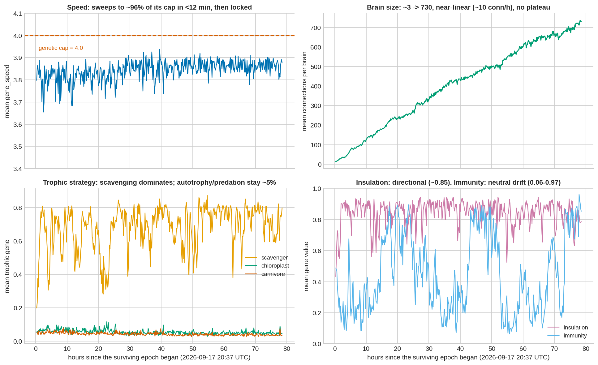
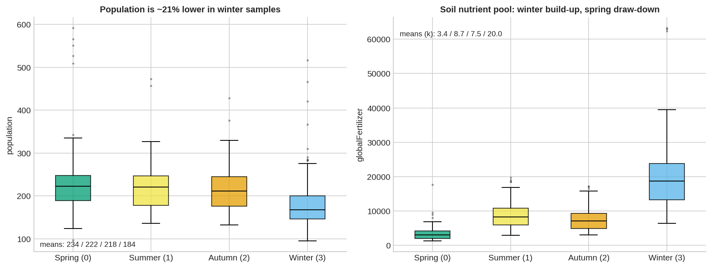

# Silicon Petri Dish (petriChip)

An autonomous, real-time evolutionary ecosystem and artificial life simulation framework. This project explores biologically-inspired mathematical ecosystems across different computational environments, ranging from edge microcontrollers to scalable Node.js servers. The simulation features emergent behaviors driven by neural networks, strict resource limitations, and physical interactions.

## Framework Architectures

The repository contains three distinct implementations of the simulation, each scaling in biological complexity and computational requirements.

### 1. BionotesESP32.ino: Native ESP32 Evolutionary Simulation

The foundational implementation runs entirely on an ESP32 microcontroller, hosting both a C++ physics engine and a mathematical neural-network ecosystem. 

*   **Fixed Topology Neural Networks:** Organisms possess 100-gene neural networks consisting of 8 sensory inputs, 8 hidden neurons, and 2 motor outputs.
*   **Edge Computing Dashboard:** The simulation broadcasts a high-performance 60 FPS dashboard to connected browsers via a local web server served directly from the ESP32 PROGMEM.
*   **Environmental Radiation via EMF:** The ESP32 asynchronously scans for nearby WiFi networks using `WiFi.RSSI()`. Strong local signals (such as a mobile hotspot) are interpreted as environmental radiation. This triggers physical displacement through electromagnetic drift and radically increases mutation rates, forcing saltation (extreme speciation events) if reproduction occurs during exposure.

### 2. server.js: Node.js NEAT Lite Architecture

A server-side implementation utilizing Node.js, designed for massive scale and topological evolution. 

*   **Expanded Ecosystem:** Supports a 3000x3000 dimensional arena capable of sustaining 600 simultaneous organisms and 1500 resource items.
*   **NeuroEvolution of Augmenting Topologies (NEAT):** Replaces the fixed neural topology with dynamic brains. Organisms start with rudimentary instinct wires and can randomly mutate to add nodes or connections, theoretically increasing cognitive capacity over evolutionary time.
*   **Memory States:** Organisms retain a cyclical memory vector, allowing historical context to influence immediate motor decisions.
*   **Automated Analytical Observer:** Integrates the Gemini API to periodically evaluate the CSV-logged population metrics, functioning as an artificial evolutionary biologist providing real-time hypotheses on the ecosystem's state.

### 3. server_v2.js: Advanced Biogeochemical and Trophic Ecosystem

The most sophisticated version, introducing strict conservation of mass, thermodynamic limits, and complex ecological niches.

*   **Strict Nutrient Cycling:** Mass is conserved perfectly. Burned metabolic energy, dead organism mass, and consumed resources return to a global geological nutrient pool (`globalFertilizer`), which mathematically dictates the replenishment rate of consumable items.
*   **Trophic Specialization:** Organisms evolve along a mutually exclusive trophic spectrum governed by genes for autotrophy (`gene_chloroplast`), detritivory (`gene_scavenger`), and predation (`gene_carnivore`). Detritivores extract energy from toxic corpses, while autotrophs draw trace energy directly from the environment.
*   **Milankovitch Cycles and Seasonality:** The environment undergoes cyclic climatic shifts. Short-term seasonal cycles (Spring, Summer, Autumn, Winter) alter food spawn rates and thermal penalties. Long-term epochs (Ice Age, Greenhouse Drought, Holocene) impose severe selective pressures on the population.
*   **Thermal Adaptation and Epidemiology:** Survival in climatic extremes requires the evolution of insulation (`gene_insulation`). Furthermore, winter seasons trigger viral outbreaks, necessitating the evolution of immunity (`gene_immunity`) to resist infection and metabolic drain.
*   **Intent and Kin Recognition:** Organisms use a dedicated neural output to signal aggressive or reproductive intent, introducing Hamilton's Rule (kin selection) into mating and combat decisions.

## Fundamental Biological Mechanics

Across all implementations, survival and replication are intrinsic metrics. There is no artificial fitness function.

*   **Sensory and Niche Selection:** Organisms perceive the distance, angle, and genetic similarity of the nearest living organism, as well as their own internal energy state. This allows for dynamic behavioral switching between foraging, evasion, and reproduction.
*   **Evolvable Morphology (r/K Selection):** Body plan genes (`gene_speed`, `gene_vision`, `gene_size`) dictate life-history strategies. High mass (K-selection) grants predation power and energy storage but incurs severe basal metabolic costs and high reproductive thresholds. Low mass (r-selection) enables rapid, cheap reproduction.
*   **Metabolic Constraints and Senescence:** Energy is depleted according to Kleiber's Law allometric scaling, kinetic drag, neural processing costs, and thermal penalties. Extrinsic stochastic mortality and age-related metabolic decay ensure continuous selective pressure.
*   **Reproductive Dynamics:** Sexual reproduction (crossover) requires mutual intent, threshold energy reserves, and morphological compatibility, enabling rapid discovery of beneficial traits. Asexual reproduction (mitosis) is biologically permitted but computationally penalized with exorbitant energy costs to enforce the advantage of mating.

## Empirical Observation Report

The following report analyzes an extended 78.5-hour runtime of `server_v2.js`, documenting the emergent evolutionary phenomena.

### Key Findings

1.  **The Founder Filter:** The simulation is a near-lethal environment. Of 196 completed founder epochs, the median survival time was 1.5 minutes. Most lineages starve before selection can operate.
2.  **Evolutionary Rescue:** In the single epoch that survived for 78.5 hours (achieving 1.36 million births and an ancestry depth of 10,516 generations), survivors rapidly doubled their speed and tripled their neural connections within the first 10 minutes.
3.  **Boundary Selection:** Mean velocity locked at 3.84 against a hard cap of 4.0. Directional selection drove the trait to the constraint ceiling, exhausting variation.
4.  **Detritivory Dominance:** The scavenger gene stabilized around 0.7. Autotrophy and carnivory remained low (~4-5%). A tight necromass recycling loop became the optimal survival strategy.
5.  **Thermal Directional Adaptation:** Insulation genes rose from 0.50 to approximately 0.85, tracking the mathematically defined optimal state for minimizing thermal penalties across normal eras.
6.  **Alternative Stable States (r/K Shift):** The population exhibited distinct body-size regimes. Large-body states (mean ~2.2) correlated with lower birth rates and longer lifespans, while small-body states (mean ~1.3) exhibited high turnover. Switches between these states were abrupt, resembling punctuated equilibrium.
7.  **Seasonal Nutrient Cycling:** A defined seasonal sawtooth emerged. Winter famines caused the soil nutrient pool to accumulate (due to high mortality), followed by rapid depletion during the spring bloom.
8.  **Neutral Evolution:** Immunity randomly walked across its range (0.06 to 0.97) due to the failure of epidemics to establish effective transmission, demonstrating genetic drift and potential hitchhiking with body-size sweeps.

### Figures

*   
*   
*   
*   

## Installation and Execution

### ESP32 Microcontroller (`BionotesESP32.ino`)

1.  Open the file in the Arduino IDE.
2.  Provide valid local WiFi credentials to the `ssid` and `password` constants.
3.  Compile and flash to an ESP32 development board.
4.  Monitor the Serial output (115200 baud) to obtain the assigned local IP address.
5.  Navigate to the IP address in a web browser to view the real-time simulation dashboard.

### Node.js Servers (`server.js` and `server_v2.js`)

1.  Ensure Node.js is installed on the host machine.
2.  Navigate to the `petriChipNode` directory.
3.  Install dependencies: `npm install express socket.io dotenv`
4.  (Optional) Provide a valid Gemini API key in a `.env` file (`GEMINI_API_KEY=your_key`) for the analytical observer.
5.  Execute the desired simulation: `node server.js` or `node server_v2.js`.
6.  Access the simulation at `http://localhost:3000`.

## Limits and Constraints

*   Population metrics are currently logged as aggregate means, masking intra-population variance and specific clade dynamics.
*   Topological neural growth outpaces expected functional utility. Current analysis suggests a significant portion of connection growth represents inert structural bloat rather than active cognitive processing.
*   Carrying capacity fluctuates dramatically based on localized resource availability and thermodynamic era, rather than remaining static.
